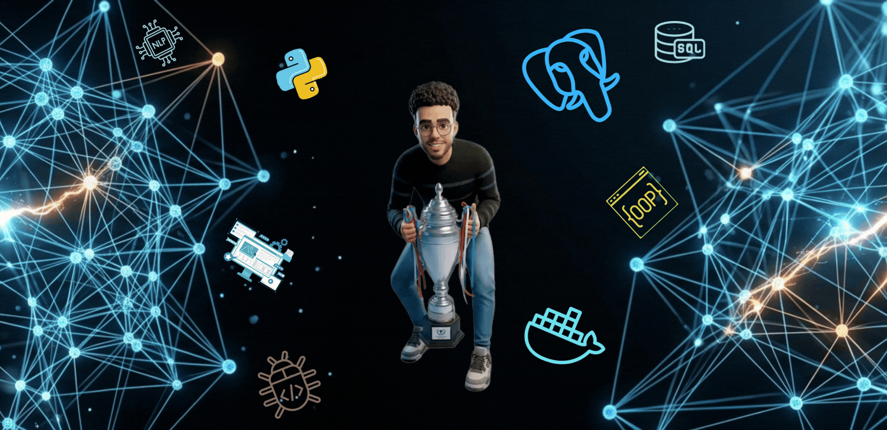

  

<h1 align="center">Ali Elbahrawy</h1>

  <strong>AI Engineer</strong>

  Machine Learning • Computer Vision • Generative AI • MLOps

  Building intelligent systems from research to production.

  

  

  

## About

I'm an AI Engineer focused on designing, building, and deploying intelligent systems that solve real-world problems.

My primary interests include:

- Machine Learning
- Computer Vision
- Generative AI
- MLOps

I enjoy transforming research into practical, production-ready AI applications.

## Focus Areas

| Machine Learning | Computer Vision |
|------------------|-----------------|
| Supervised Learning | Image Classification |
| Unsupervised Learning | Object Detection |
| Feature Engineering | Image Segmentation |
| Model Evaluation | OCR |

| Generative AI | MLOps |
|---------------|--------|
| LLM Applications | Model Deployment |
| Prompt Engineering | Docker |
| RAG | CI/CD |
| AI Agents | Model Monitoring |

## Technologies

### Languages

  

### Machine Learning

  

### Computer Vision

  

### Data

  

### MLOps

  

### Exploring

  

## GitHub Analytics

  
  

  

  

## Currently Learning

- Large Language Models (LLMs)
- Retrieval-Augmented Generation (RAG)
- AI Agents
- Production MLOps
- Distributed Training

## Philosophy

> Turning machine learning research into production-ready AI systems.